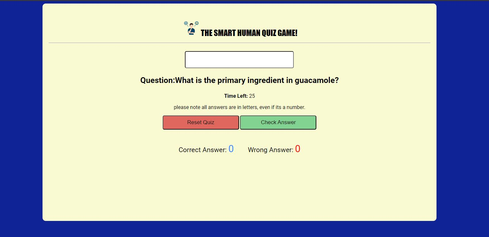

## THE SMART HUMAN QUIZ

The Smart Human Quiz is a game to help adults, parents, teachers and anyone who would like to take the time to build on their knowledge on variety of general topics. The topics in the game ranges from science, sports, animal, geography and so many more topics. There are many studies which shows that a higher knowledge on general topics helps as a conversation starter, makes you more interesting and also makes you look smarter than others. The game can also be played my a family, as not only is it fun but educative as well. 

Frequent users of this game will have to answer challenging questions which will test your knowledge and skills in various categories. The game is designed for solo play as family and friends can take a turn. The goal is to answer as many questions correctly as possible.

## Features

### Existing Features

- Header
   - At the top of the page shows the game name: The Smart Human Quiz with a logo showing a person thinking of what the answer of the question could be.
   - The header clearly tells the user they would be playing a quiz game.

  

- The Game Options
   - Once the page loads you would be asked a question which could range from any topic. Read the question carefully and type the correct answer in the which box provided.
   - You could type enter or move the mouse crusor to the Check Answer button. This would tell you if you were right or wrong.

  
     

 - The Game Scoring 
   - The pop up message will tell you if you were right or wrong.
   - This would follow my your score updating at the bottom of the page.

  

 - The Game Timing
   - The game is timed to 60 seconds and after that the game will be over.
   - The aim of the game is not to finish all the questions but get as many right answers as possible.
   - The player with the highest right answer wins the game.      
  
  

  

  
 
      

 

