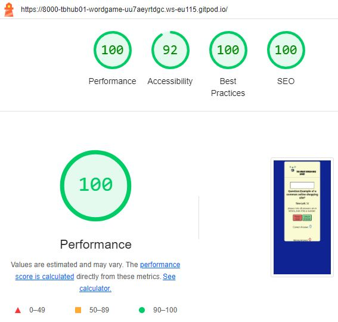

## THE SMART HUMAN QUIZ

The Smart Human Quiz is a game to help adults, parents, teachers and anyone who would like to take the time to build on their knowledge on variety of general topics. The topics in the game ranges from science, sports, animal, geography and so many more topics. There are many studies which shows that a higher knowledge on general topics helps as a conversation starter, makes you more interesting and also makes you look smarter than others. The game can also be played my a family, as not only is it fun but educative as well. 

Frequent users of this game will have to answer challenging questions which will test your knowledge and skills in various categories. The game is designed for solo play as family and friends can take a turn. The goal is to answer as many questions correctly as possible.

## Features

### Existing Features

- Header
   - At the top of the page shows the game name: The Smart Human Quiz with a logo showing a person thinking of what the answer of the question could be.
   - The header clearly tells the user they would be playing a quiz game.

  

- The Game Options
   - Once the page loads you would be asked a question which could range from any topic. Read the question carefully and type the correct answer in the which box provided.
   - You could type enter or move the mouse crusor to the Check Answer button. This would tell you if you were right or wrong.

  
     

 - The Game Scoring 
   - The pop up message will tell you if you were right or wrong.
   - This would follow my your score updating at the bottom of the page.

  

 - The Game Timing
   - The game is timed to 60 seconds and after that the game will be over.
   - The aim of the game is not to finish all the questions but get as many right answers as possible.
   - The player with the highest right answer wins the game.      
  
  

  ## Testing
   - I tested playing the game in Chrome and Safari.
   - I can confirm the score boards are always accurrate.
   - I can confirm the header, instructions, results text are all readable and easy to understand.
   - I can confirm the colors and fonts and text chosen are all readable on computer and mobile view.
   - I can confirm a lighthouse in devtools have been done and the result are below:

   
     
   - I can confirm the project is responsive, looks good and all functions, screen size works using the devtools toolbar.

   ## Bugs

   ### Solved bugs

   - I noticed on devtools my page layout wasnt responding to other devices such as iphone so I had to readjust my CSS media codes to solve this issue.
   - I also had issues with my reset button event listner as it wasnt resetting the game display correctly. This was resolved by adding calling the reset button to the reset game function.

   ### Validator Testing 
   - HTML
      - No error returned on final submitted codes using the official W3C validator
   - CSS
      - No error returned on final submitted codes using the official Jigsaw validator
   - JSHINT
      - No error and one undefined variable returned on final submitted codes using the official JSHINT validator

   ### Unfixed Bugs
   The timer speed tends to be periodic but works as expected.

   ## Deployment
   - The site was deployed to GitHub pages. The steps to deploy are as follows:
      - In the GitHub repository, navigate to the Settings tab
      -  From the source section drop-down menu, select the Master Branch
      -  Once the master branch has been selected, the page provided the link to the completed website.

   The live link to the website is:  https://tbhub01.github.io/word-game/
  

  
 
      

 

